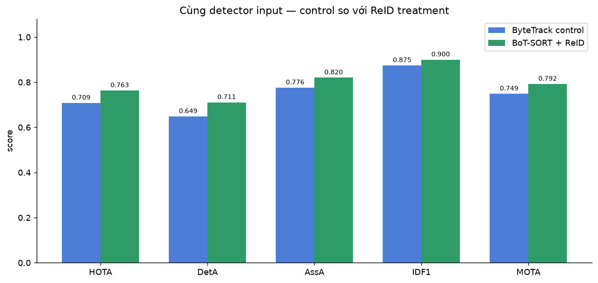
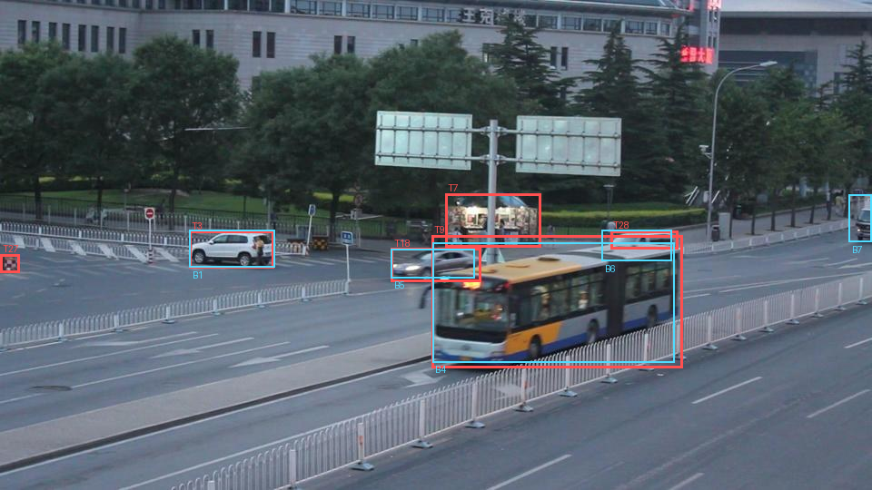
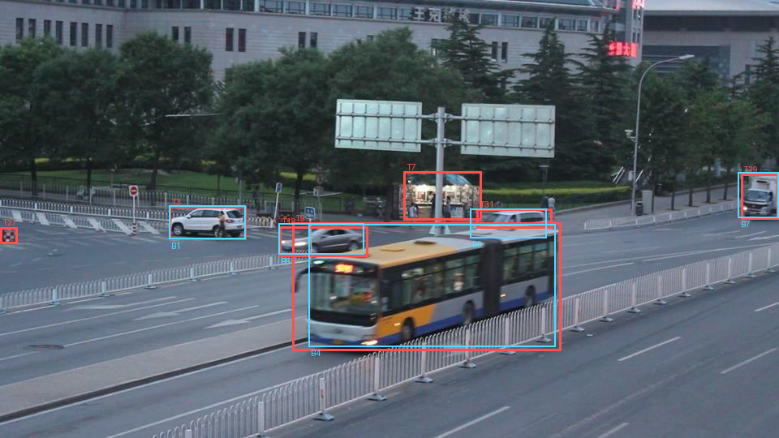

# Báo cáo Ngày 3 — Tracking Annotation

Họ tên / nhóm: **Nguyễn Hải Long — MSSV 2A202602308** (theo tên repository).

Ngày: **15/09/2026**. Báo cáo dùng lần chạy lại notebook trên Windows/CPU, với cấu hình thực tế trong `outputs/model_run_config.json`.

## 1. Quá trình gán nhãn

| Mục | Giá trị |
| --- | --- |
| Công cụ | Chưa xác nhận công cụ trực tiếp gán; dữ liệu xuất là MOT 1.1 |
| Thời gian gán `clip_02` (warm-up) | Chưa ghi nhận |
| Thời gian gán `clip_01` | Chưa ghi nhận |
| Số track đã vẽ trong `clip_01` | 8 track, ID 1–8; 573 bbox trên 190 frame |
| Số keyframe trung bình mỗi track | MOT không lưu keyframe; cần dữ liệu từ công cụ gán nhãn |

Ba tình huống khó được xác định khi phân tích ảnh và kết quả hiện tại (không phải nhật ký thao tác gán nhãn):

1. **Xe chồng lấp:** frame 104–113, xe ID 6 bị xe buýt ID 4 che một phần. Cần theo dõi liên tục, khoanh phần nhìn thấy và giữ ID khi vẫn xác định được cùng xe. ReID đổi T24→T31 ở frame 113, trong khi annotation giữ B6.
2. **Xe ở rìa ảnh:** frame 107–109, xe tải B7 đi vào từ mép phải. Cần kiểm frame đầu, cắt bbox tại biên ảnh; không bỏ nhãn chỉ vì model chưa bắt được.
3. **Xe đứng yên và vật thể không phải xe:** phân biệt xe trắng B1 với khu vực quầy/biển bên đường mà ReID khoanh nhầm thành T7 tại frame 107. Không dùng chuyển động làm tiêu chí duy nhất để quyết định có phải xe.

## 2. Tự kiểm và kiểm chéo

Kết quả kiểm tra hiện có; chưa có nhật ký xác nhận đã tua toàn bộ clip đủ ba lượt:

- Lượt 1 — ID: annotation có 8 ID, không có ID switch khi chấm với gold hiện tại. ReID đổi ID cho B5 tại frame 87 và B6 tại frame 113.
- Lượt 2 — đầu/cuối: frame 107 cần chú ý B7 ở rìa phải, chưa có bbox ReID khớp. Cần kiểm toàn bộ đầu/cuối từng track trong lần review thủ công.
- Lượt 3 — giữa track: frame 140, ReID T3 khớp B1 với IoU 0,5460, cần xem lại đoạn chồng lấp. Validator đã báo 0 lỗi định dạng, 1 cảnh báo B1 gần như đứng yên ở frame 1–15; cảnh báo chưa tự chứng minh nhãn sai.

Kiểm chéo với: **chưa ghi nhận**. Chưa có `reports/review_partner.md`.
Số lỗi mỗi bên tìm được: **chưa ghi nhận**, không coi là 0 lỗi.

Chưa có evidence về quyết định khác nhau giữa hai người. Các luật về xe đứng yên, bbox phần nhìn thấy khi bị che và frame bắt đầu của xe ở rìa đã được tổng hợp trong `GUIDELINE_MINI.md` sau phân tích notebook; chưa có xác nhận kiểm chéo.

## 3. Pre-gold lock và chấm trước/sau rework

| Evidence | Giá trị |
| --- | --- |
| SHA-256 từ `evidence/pre-gold/clip_01/manifest.json` | `94a2bd34aa00348b49cd3ec48e85dbfeaf00504b97349e343363d40e4d1f9d79` |
| Thời điểm khóa theo manifest | `2026-09-15T15:54:56.632152+00:00` (UTC) |
| Số row / frame / track trong snapshot | 573 / 190 / 8 |

| | HOTA | DetA | AssA | LocA | IDF1 | MOTA | MOTP | FP | FN | IDSW |
| --- | ---: | ---: | ---: | ---: | ---: | ---: | ---: | ---: | ---: | ---: |
| Bản pre-gold | 1.0000 | 1.0000 | 1.0000 | 1.0000 | 1.0000 | 1.0000 | 1.0000 | 0 | 0 | 0 |
| Annotation hiện tại (hàng sau rework) | 1.0000 | 1.0000 | 1.0000 | 1.0000 | 1.0000 | 1.0000 | 1.0000 | 0 | 0 | 0 |

Qua cổng (`IDF1 >= 0.80`, `MOTA >= 0.75`, `MOTP >= 0.70`): **có, theo gold hiện tại**.

Annotation, snapshot và gold hiện tại có **cùng SHA-256**, tức là giống nhau từng byte. Điểm 1,0000 nhất quán với dữ liệu này; nó không tự chứng minh nguồn gốc độc lập của annotation hoặc thời điểm đã xem reference. Manifest lưu thời điểm khóa, không xác minh được thời điểm người làm mở reference.

Không có chênh lệch giữa snapshot và annotation hiện tại, nên chưa ghi nhận rework:

| Loại lỗi | Frame | ID | Đã sửa thế nào |
| --- | --- | --- | --- |
| Không có sửa đổi được chứng minh bằng chênh lệch file | 1–190 | 1–8 | Giữ nguyên; chưa có nhật ký rework |

Nguồn: `outputs/eval_pre_gold.json`, `outputs/eval_vs_gold.json` và hash ba file.

## 4. Kết quả model: ByteTrack control vs ReID treatment

Cấu hình từ `outputs/model_run_config.json` sau lần chạy notebook tại máy này:

| Mục | Giá trị |
| --- | --- |
| Python / ultralytics / torch / lap | 3.12.10 / 8.4.145 / 2.14.0+cpu / 0.5.13 |
| weights / hai tracker | `yolo26n.pt`; `bytetrack.yaml`; `configs/trackers/botsort-reid.yaml` |
| conf / IoU NMS / imgsz / classes | 0.25 / 0.70 / 960 / `[2, 5, 7]` (car, bus, truck) |
| device | `cpu` |
| Dữ liệu / trạng thái | 190 frame, 960×540, 12.5 fps; `persist=True` |
| ReID | `with_reid: true`, `model: auto`, `appearance_thresh: 0.80`, `proximity_thresh: 0.50`, `gmc_method: none` |

Ngưỡng IoU đánh giá là **0.5**, khác ngưỡng NMS 0.70. ByteTrack xuất 607 bbox/16 track; ReID xuất 638 bbox/16 track. Thí nghiệm ngưỡng ReID được bỏ qua đúng mặc định `RUN_EXPERIMENT=False`.

| So sánh | HOTA | DetA | AssA | LocA | IDF1 | MOTA | MOTP | FP | FN | IDSW |
| --- | ---: | ---: | ---: | ---: | ---: | ---: | ---: | ---: | ---: | ---: |
| bạn vs gold | 1.0000 | 1.0000 | 1.0000 | 1.0000 | 1.0000 | 1.0000 | 1.0000 | 0 | 0 | 0 |
| ByteTrack control vs gold | 0.7085 | 0.6487 | 0.7761 | 0.8463 | 0.8746 | 0.7487 | 0.8226 | 88 | 54 | 2 |
| BoT-SORT + ReID vs gold | 0.7635 | 0.7110 | 0.8204 | 0.8721 | 0.9001 | 0.7923 | 0.8595 | 91 | 26 | 2 |
| ReID vs bạn | 0.7635 | 0.7110 | 0.8204 | 0.8721 | 0.9001 | 0.7923 | 0.8595 | 91 | 26 | 2 |

Nguồn: `outputs/eval_vs_gold.json`, `eval_bytetrack_vs_gold.json`, `eval_reid_vs_gold.json`, `eval_reid_vs_me.json`. Bảng dùng bốn chữ số thập phân từ JSON.

## 5. Phân tích — năm câu hỏi

**1. MOTA của bạn cao hơn hay thấp hơn IDF1? Nếu MOTA cao mà IDF1 thấp thì điều đó nói gì, và vì sao MOTA không phạt nặng lỗi ID?**

MOTA và IDF1 của annotation cùng bằng 1,0000. Với model, MOTA thấp hơn IDF1: ByteTrack 0,7487 so với 0,8746; ReID 0,7923 so với 0,9001.

Theo `tools/motlib.py`, `MOTA = 1 − (FN + FP + IDSW) / số bbox gold`. Một lần đổi ID chỉ cộng một đơn vị IDSW dù ID sai kéo dài nhiều frame; IDF1 ghép identity trên toàn chuỗi nên có thể chịu ảnh hưởng ở nhiều frame. MOTA cao nhưng IDF1 thấp có thể cho thấy tìm vị trí vật thể tốt nhưng giữ danh tính kém. Khác số ID giữa hai bản tự nó không phải lỗi; cần xét sự tương ứng và tính liên tục.

**2. ByteTrack control và BoT-SORT + ReID treatment khác nhau thế nào ở IDF1, AssA và IDSW? Dẫn một frame sequence để giải thích treatment tốt hơn, tệ hơn hoặc không đổi đáng kể. Nhắc rõ đây không cô lập causal effect của ReID vì hai tracker implementation khác.**

IDF1 tăng 0,0255; AssA tăng 0,0443; IDSW vẫn bằng 2. Treatment cải thiện identity tổng thể nhưng không giảm số lần đổi ID.

Ví dụ xe buýt B4, frame 58–60:

| Frame | ByteTrack: ID khớp / IoU với B4 | ReID: ID khớp / IoU với B4 |
| --- | --- | --- |
| 58 | Không khớp, IoU tốt nhất 0 | T9 / 0.8182 |
| 59 | T15 / 0.8940 | T9 / 0.8856 |
| 60 | T15 / 0.8408 | T9 / 0.9057 |

Log CLEAR ghi ByteTrack đổi B4 từ T14 sang T15 ở frame 59; ReID giữ T9 trong chuỗi trên. Tuy nhiên ReID vẫn đổi ID B5 ở frame 87 (T17→T18) và B6 ở frame 113 (T24→T31), nên cải thiện không đồng đều ở mọi xe.

Đây là **so sánh hai hệ thống, không cô lập causal effect của ReID**: ByteTrack và BoT-SORT khác implementation. Dù detector input và tham số giữ cố định, không thể quy toàn bộ chênh lệch chỉ cho appearance/ReID.

**3. DetA, FP và FN đổi thế nào? Lỗi còn lại là detector hay association?**

DetA tăng 0,6487→0,7110 (+0,0623); FP tăng 88→91 (+3); FN giảm 54→26 (−28). MOTA tăng 0,0436, phù hợp với tổng FP+FN+IDSW giảm 144→119 trên 573 bbox gold.

Lỗi còn lại có cả detection/localization và association: T7 ở frame 107 khoanh khu vực quầy/biển; xe tải B7 ở rìa phải bị thiếu; B6 bị đổi identity ở frame 113. Tuy nhiên FP/FN tính trên đầu ra tracker, nên riêng các metric không tách chính xác được lỗi detector thô khỏi lọc/duy trì track. Cùng detector vẫn có thể có số bbox đầu ra tracker khác nhau.

**4. Một chỗ bạn đúng và ReID sai (frame, ID, vì sao):**

**Frame 107, annotation B7:** ảnh có một phần xe tải đi vào từ mép phải; annotation có bbox, nhưng không bbox ReID nào chồng lấp (IoU tốt nhất 0). Đồng thời **T7 của ReID** khoanh khu vực quầy/biển bên đường. B7 và T7 thuộc hai hệ ID riêng, không phải cùng vật thể chỉ vì cùng số 7.

**5. Một chỗ ReID làm bạn xem lại annotation (frame, ID, vì sao), hoặc lý do evidence cho thấy model sai:**

**Frame 104–113, B6:** model khiến cần xem lại đoạn xe bị xe buýt che. T24 khớp B6 ở frame 104 (IoU 0,5220); frame 107, T28 chỉ đạt 0,4823, dưới ngưỡng 0,5; frame 112, T31 đạt 0,4639; frame 113, T31 đạt 0,5661. Log ghi đổi T24→T31 tại frame 113. Ảnh frame 107 và 113 cùng chuỗi annotation hỗ trợ kiểm tra liên tục B6, không đổi annotation theo ID mới của model.

Chưa có evidence xác nhận model đúng còn annotation sai trong các frame đã kiểm. Gold hiện trùng annotation, nên đồng ý với gold không thay thế kiểm ảnh độc lập. Chưa sửa annotation chỉ vì model bất đồng.

Notebook xếp frame 107, 108, 106, 111 cao nhất về bất đồng. Frame 107 và 108 đều có 3 bbox chỉ model có, 2 bbox chỉ annotation có và 0 lệch ID theo phép ánh xạ của cell này. Phép đếm đó khác IDSW của CLEAR; bbox lệch dưới ngưỡng cũng thành không khớp, nên cần xem ảnh để diễn giải.

## 6. Nếu phải gán thêm 10 clip nữa

Đề xuất cập nhật `GUIDELINE_MINI.md` và quy trình:

- Ghi rõ xe thật đang đỗ vẫn thuộc vehicle; quầy/biển không thuộc lớp này. Dùng frame 107 làm ví dụ tránh theo model sai.
- Thống nhất bbox phần nhìn thấy khi bị che và cắt tại rìa; thêm ví dụ B6 frame 104–113, B7 frame 107–109.
- Ghi rõ điều kiện giữ ID khi che ngắn theo ngưỡng lab 25 frame, cách xử lý khi không chắc và luật xe rời ảnh rồi quay lại dùng track mới.
- Đặt keyframe dày quanh đầu/cuối, chồng lấp, đổi hình dạng bbox; lưu số keyframe từ công cụ vì MOT không giữ thông tin này.
- Ghi thời gian, nhật ký frame/ID và ba lượt review; lưu tên người kiểm chéo, lỗi và quyết định giải quyết.
- Khóa nhãn độc lập trước khi xem reference/model; lưu hash và lịch sử sửa. Chỉ rework khi ảnh hỗ trợ quyết định.
- Lưu cấu hình, phiên bản và output tương ứng mỗi lần chạy, tránh trộn số liệu CPU với cấu hình Colab/GPU.

Các luật và ca minh họa đã được bổ sung vào `GUIDELINE_MINI.md` sau phân tích. Các cải tiến quy trình là đề xuất cho lần làm tiếp theo; kiểm chéo chưa hoàn tất.

## 7. Tệp đã nộp

Danh sách phản ánh file có trong workspace; chưa xác nhận đã push thay đổi của lần chạy/báo cáo này.

- [x] `annotations/clip_01/gt.txt`
- [x] `annotations/clip_02/gt.txt`
- [x] `evidence/pre-gold/clip_01/gt.txt` và `manifest.json`
- [x] `GUIDELINE_MINI.md` đã điền — bản tổng hợp sau phân tích, có nêu phần chưa xác nhận
- [x] `outputs/eval_vs_gold.json`
- [x] `outputs/model_bytetrack_clip_01.txt`
- [x] `outputs/model_reid_clip_01.txt`
- [x] `outputs/model_run_config.json`
- [x] `outputs/eval_bytetrack_vs_gold.json`, `outputs/eval_reid_vs_gold.json`, `outputs/eval_reid_vs_me.json`
- [ ] `reports/review_partner.md` — chưa có
- [x] `reports/REPORT.md` (file này)

Ảnh minh chứng: `reports/evidence/`. Bản notebook đã thực thi và ảnh bổ sung lưu cục bộ ở `outputs/vis_report/`, thuộc nhóm output hình bị Git bỏ qua.
